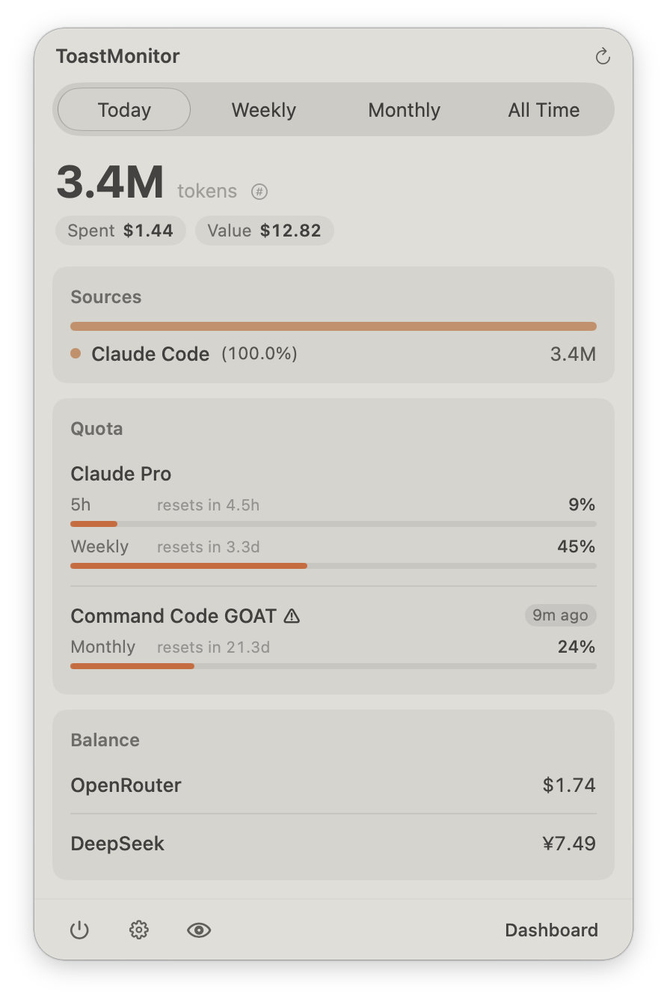

# ToastMonitor

[](https://github.com/Toast1zz/ToastMonitor)
[](Package.swift)
[](LICENSE)

Native macOS menu-bar AI usage monitor (SwiftUI + system SQLite, zero third-party dependencies).

Aggregates token usage from **Claude Code, Codex, OpenCode, Hermes, Oh My Pi and DeepSeek Harness** local logs, plus **OpenRouter** cloud quota — everything rolls up into one "today" total, always visible in the menu bar.

<p align="center">
  
</p>

## Features

- **Live menu-bar total** — today's tokens only; click for the popover
- **Custom menu-bar font** — Settings → General → Token count font opens the macOS font panel to pick any installed font for the menu-bar token count; defaults to System UI (SF Pro)
- **Popover** — token total with Spent / Value, then cards for Sources, Quota, Balance and Activity. Hover a card title to hide it with the eye button; the footer eye brings hidden cards back, and Settings → Popover picks which cards and accounts appear
- **Subscription quotas** — one usage bar per window (Claude 5h / weekly, OpenCode Go rolling / weekly / monthly, Codex, Command Code) that fills as the quota is used, with its reset countdown; bars turn red past 80%
- **Balances** — OpenRouter and DeepSeek prepaid balances in their own card, written with currency symbols
- **Claude usage outside this Mac** — an estimate of the weekly Claude quota consumed by Cowork, claude.ai chat or Claude Code on another machine, which leave no local transcript
- **Full panel (4 tabs)** — Overview / Usage Analysis / Plans & Balance / Sessions
- **Settings window** — ⌘, or the popover's gear button; a standard macOS settings window with General, Popover, Sources, Data and Updates panes
- **Cross-source aggregation** — one SQLite store for tokens, cost and per-project breakdown across all tools, by day/week/month
- **Built-in quotas** — no opencode-quota dependency; see [Quotas](#quotas-built-in-no-opencode-quota-dependency)
- **DeepSeek account billing** — official balance plus experimental Platform account spend in the popover, following the selected day/week/month period; includes usage from other devices ([connect guide](docs/connect-deepseek.md))
- **Cost estimation** — built-in model price table; unknown models count tokens without a price
- **Privacy-first** — data stays on this Mac, credentials live only in the macOS Keychain, no analytics or ad SDKs

## Data sources

| Tool | Local (Mac) source | Remote |
|---|---|---|
| Claude Code | `~/.claude/projects/*/*.jsonl`, plus Claude Desktop Cowork sessions that ran in local agent mode | VPS feed |
| Codex | `~/.codex/sessions/.../rollout-*.jsonl` + `state_5.sqlite` | VPS feed |
| OpenCode | `~/.local/share/opencode/opencode.db` | VPS feed |
| Hermes | `~/.hermes/state.db` (column introspection) | VPS feed |
| Oh My Pi | `~/.omp/agent/sessions/**/*.jsonl` | — (local only) |
| DeepSeek Harness | `$DSH_HOME` (default `~/.dsh`) session logs + projection cache | — (local only) |
| OpenRouter | Cloud API (key + credits snapshots) | — |
| DeepSeek account | Platform balance + account-wide billed usage; API-key balance-only mode | — |

### Remote feeds

- Only addresses you **explicitly configure** in Sources & Settings are contacted; the app ships no personal IPs or default remote hosts
- Addresses are validated client-side; credential requests never follow redirects
- Remote feed polling uses a 15s foreground timer and continues in background at no more than one request per 60s through the collector loop; local and remote sources can be disabled independently

### DeepSeek Harness (DSH)

DSH token accounting maps 1:1 onto ToastMonitor's columns:

| DSH bucket | ToastMonitor field |
|---|---|
| uncached input | `input_tokens` |
| output (reasoning included, never separate) | `output_tokens` |
| cache read | `cache_read` |
| cache write | `cache_write` |

Parsing uses two **mutually exclusive, sticky** modes (`dsh_parse_mode`; the choice never flips when zstd is installed/uninstalled, so the two accounting paths can never double-count):

- **Log mode (primary)** — incremental parse of `sessions/**/session.jsonl.zstd` (independent zstd frames + byte cursor), with exact timestamps and model per step; cost estimated from the price table
- **Cache mode (fallback)** — delta over the cumulative buckets in `storages/session_projcache.json`; no model or per-step timing; web sessions visible, headless sessions not

macOS ships no zstd support (Compression.framework covers LZ4/ZLIB/LZMA/LZFSE/BROTLI only), so the app looks for the `zstd` CLI on `PATH` and at standard install locations (`/opt/homebrew/bin`, `/usr/local/bin`, `/opt/local/bin`); when absent it degrades to cache mode without errors or data loss.

## Quotas (built-in, no opencode-quota dependency)

- **OpenCode Go plan** (a separate entry from the OpenCode tool) — reads `opencode.ai/workspace/<id>/go` SolidJS SSR/data-slot data: 5h=$12 / week=$30 / month=$60 bars, reset countdown and history. Credentials: paste in Plans & Balance, or `--provision-go <workspaceId>` reading the cookie from stdin (opencode-quota's opencode-go.json works)
- **OpenRouter** — `/api/v1/key` + `/api/v1/credits` snapshotted every 60s while the UI is visible and every 5 minutes in background. Key: paste in the panel or `--provision-or-key` from stdin; the secret lives only in the macOS Keychain
- **Claude subscription** (opt-in, off by default) — 5h / weekly / weekly-Opus rate-limit windows from `api.anthropic.com/api/oauth/usage`, using the login Claude Code already stored on this Mac. No credential to paste: the OAuth blob is read from `~/.claude/.credentials.json` and the `Claude Code-credentials` login-keychain item, newer expiry wins. **The read never prompts.** ToastMonitor's entry in that item's ACL is not durable (Claude Code rewrites the item several times a day as it refreshes the token); instead of surfacing a login-keychain password sheet from a background poll, an unauthorized read fails and is retried through `/usr/bin/security`, which Claude Code itself creates and updates the item through and which is therefore always trusted for it. ToastMonitor never modifies that item or its ACL
- **Claude usage outside this Mac** — Cowork sessions that run server-side, claude.ai chat and Claude Code on other machines never write a local transcript, so their tokens cannot be counted. Instead, every successful Claude quota fetch is stored as a sample (5h and weekly percentages plus reset times). Within the current weekly window, a rise in weekly usage between two samples counts as non-local when this Mac recorded essentially no Claude Code activity in that interval (under 5,000 fresh tokens, with a 10-minute look-back for server aggregation lag). The popover shows `≈X% of weekly used outside this Mac` once the week has at least 4 intervals spanning 6 hours; hover it for details. It is a lower bound: the quota is only sampled while the popover or dashboard is open, and an interval with any local activity counts as local

## Install & build

```bash
cd ~/Projects/ToastMonitor
./scripts/build-app.sh        # release build → codesign → install to /Applications (skipped in CI)
```

- After switching to Apple Development signing for the first time, run `./scripts/authorize-local-keychain.sh` once; later builds from the same Team ID never prompt again. It only ever touches ToastMonitor's own `-s ToastMonitor` items — never Claude Code's or any other app's
- Versioning comes from `vMAJOR.MINOR[.PATCH]` git tags; `TM_VERSION` / `TM_BUILD_NUMBER` are for controlled CI/release injection. Untagged local builds are explicitly `1.0` (development), never a commit hash
- Distribution requires a Developer ID certificate; `build-app.sh` refuses ad-hoc signing and accepts an explicit identity via `TM_SIGNING_IDENTITY`
- Or run the build product directly: `open dist/ToastMonitor.app`

### Release artifacts

Every release ships the arm64 and universal zips plus a signed,
architecture-aware update manifest (`appcast.json`) that powers in-app updates
(Settings → Updates). Apple Silicon selects arm64;
Intel selects the universal artifact. The legacy top-level fields remain a
universal bootstrap for older clients. The manifest is Ed25519-signed with a
key pair whose private half never leaves the maintainer's machine
(`~/.config/toastmonitor/update-key.pem`, 0600); the app bakes in the public
half.

```bash
./scripts/package-release.sh         # builds and zips both arm64 and universal apps
# Sign an architecture-aware manifest directly into dist/release/.
./scripts/sign-update-manifest.sh 1.2.3 \
  dist/release/ToastMonitor-1.2.3-arm64.zip \
  dist/release/ToastMonitor-1.2.3-universal.zip \
  dist/release/appcast.json
cp dist/release/appcast.json docs/appcast.json && cp dist/release/appcast.json appcast.json
git add -A && git commit -m "Publish update manifest for v1.2.3" && git push
gh release create vX.Y.Z dist/release/*.zip --title "..." --notes "..."
```

- The update feed is hosted on GitHub Pages (`https://toast1zz.github.io/ToastMonitor/appcast.json`, deployed from `docs/` on `main`); short cache headers make a new manifest visible to clients within a minute
- Manifest `download_url` is tag-pinned (`/releases/download/vX.Y.Z/…`) — note the `v` prefix; `/releases/latest/...` lags fresh releases and raw.githubusercontent caches stale manifests for many minutes
- Verify the live feed with `curl -s https://toast1zz.github.io/ToastMonitor/appcast.json`

## Command line (headless / development)

```bash
# Credential provisioning — always from stdin, never in argv
printf '%s\n' 'sk-or-...' | dist/ToastMonitor.app/Contents/MacOS/ToastMonitor --provision-or-key
printf '%s\n' 'auth_cookie' | dist/ToastMonitor.app/Contents/MacOS/ToastMonitor --provision-go <workspaceId>
dist/ToastMonitor.app/Contents/MacOS/ToastMonitor --provision-hermes <feedURL>   # only explicitly configured addresses
dist/ToastMonitor.app/Contents/MacOS/ToastMonitor --clear-or-key                 # clear
```

- `TM_DEBUG=1`: per-file scan decision logging
- `--render-dashboard <path> [height] [width] [tab]`: headless Dashboard PNG render (no window or keychain needed); `dark`/`light` in the path selects the appearance; tab is `overview / analysis / plans / sessions`
- `--render-popover <path> [height]`: headless popover PNG render
- `--render-settings <path> [general|popover|sources|data|updates] [height]`: headless render of one settings pane
- `--show-settings [pane] [--capture-settings <path>]`: opens the real settings window (no collectors, no keychain)
- `--show-panel`: open the popover on screen for inspection (does not start the OpenRouter / Go clients, so no Keychain prompts)
- `--show-dashboard`: launch with the panel open
- `--verify-status-toggle`: automated status-button toggle self-check (CI)

## Architecture

- **Single collection loop** — scans every 1s while the panel is visible, every 5s while hidden (to keep the menu bar fresh); incremental per-file reads keyed on (size, nanosecond mtime, inode); steady state is stat-only
- **Single SQLite store** — `~/Library/Application Support/ToastMonitor/toastmonitor.db` (WAL)
- **Cost estimation** — built-in price table for common models (Claude/GPT/DeepSeek, …); unknown models count tokens only; `backfillCosts()` corrects history idempotently

## Data, privacy & security

- **Updates** — callers must supply an HTTPS metadata URL plus an Ed25519 public key fixed to the artifact; `UpdateChecker` validates the metadata signature, version and SHA-256 of the download; the file is downloaded only after user confirmation and re-verified before use. Never auto-downloads, installs or executes updates
- **Data maintenance** — `DataMaintenance.exportDatabase(to:)`, `clearAllData()`, local cleanup, protected backups and pre-restore validation; clearing forces a protected backup first; backups/exports land in the user directory restricted to the current user. Stop collection and keep the backup before clearing or restoring
- **Privacy** — logs, usage, project paths and session metadata stay in the local SQLite by default; requests go out only to explicitly enabled remote feeds or quota services. Credentials are stored in the macOS Keychain, never in URLs, plists or diagnostic logs; no analytics or ad SDKs

## Known limitations

- The menu bar shows only today's tokens (user preference); cost and fixed subscriptions live in the tooltip/panel
- Claude usage that leaves no local transcript (server-side Cowork, claude.ai chat, other machines) is estimated from the shared quota, never counted in tokens
- The price table is approximate (official list prices); OpenCode's own cost field is used verbatim when present
- DSH log mode depends on the `zstd` CLI (see lookup logic above); cache mode has no model, so cost is 0

## Contributing

See [CONTRIBUTING.md](CONTRIBUTING.md) for the build, test and PR workflow, and [SECURITY.md](SECURITY.md) for reporting vulnerabilities.

## License

MIT — see [LICENSE](LICENSE). Third-party system components remain under their own licenses.
